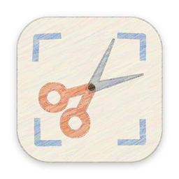

<p align="center">
  
</p>

<h1 align="center">Snipsy</h1>

<p align="center">Snip any part of your screen and send it, with a prompt, straight into a Claude Code or Codex session.</p>

<p align="center"></p>

- **⇧⌘2** anywhere, drag an area. Stack as many as you like.
- Pick a **Claude Code** or **Codex** session (terminal or desktop app), write a prompt, **↵** to send.
- Or pick **Clipboard**: your prompt, the screenshots' file paths and the image, ready to paste in any chat.

Everything stays on your Mac. Snipsy is an independent project, not affiliated with Anthropic or OpenAI.

## Install

1. **App** (macOS 14+): download it from the [latest release](https://github.com/geoffroyO/snipsy/releases/latest), move it to Applications, open it and allow screen capture.
2. **Plugin**, for the agents you use:

   ```sh
   # Claude Code (terminal, or the Claude app's Code tab)
   claude plugin marketplace add geoffroyO/snipsy && claude plugin install snipsy@snipsy

   # Codex (terminal, or the ChatGPT app). Codex asks you to approve the hooks once, or run /hooks.
   codex plugin marketplace add geoffroyO/snipsy && codex plugin add snipsy@snipsy
   ```

   Then start a new session. Snipsy's *Setup* tab turns green when it sees it.

Screenshots arrive with your next message in that session. For **instant delivery** (Claude Code only, research preview), start it with `claude --dangerously-load-development-channels plugin:snipsy@snipsy`.

Requires Python 3 (from the Xcode command line tools or Homebrew).

## How it works

```
Snipsy.app ──▶ bridge/server.py (127.0.0.1:7823) ──▶ ~/.snipsy/inbox/<session>/
                                                        ├─▶ hook.py     next prompt (Claude Code, Codex)
                                                        └─▶ channel.py  instantly (Claude Code ⚡)
```

The plugin's hook registers each session and starts the local bridge. The bridge only accepts the app: requests without its header, or coming from a web page, are rejected.

## Development

| | |
|---|---|
| `app/` | macOS menu bar app: SwiftUI, sandboxed, Swift 6. Open `app/Snipsy.xcodeproj`, ⌘R. |
| `plugin/` | One plugin for Claude Code (`.claude-plugin/`) and Codex (`.codex-plugin/`): hooks, local bridge, channel, and a `snipsy` skill so the agent can explain setup and usage. |
| `tests/` | Bridge tests: `python3 -m unittest discover tests` |
| `scripts/make_icon.py` | Regenerates the app icon (Pillow, numpy). |

- Check the plugin: `claude plugin validate .`
- Debug builds can render the UI to PNGs: `Snipsy.app/Contents/MacOS/Snipsy -snapshot 1`
- Release: `scripts/release.sh` archives, signs with Developer ID, notarizes, builds the DMG and publishes the GitHub release (one-time setup in the script's header).

[MIT License](LICENSE) · [Privacy](PRIVACY.md)
